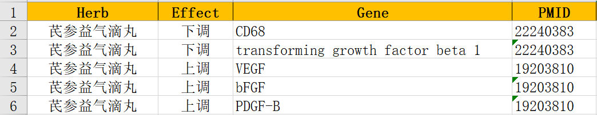
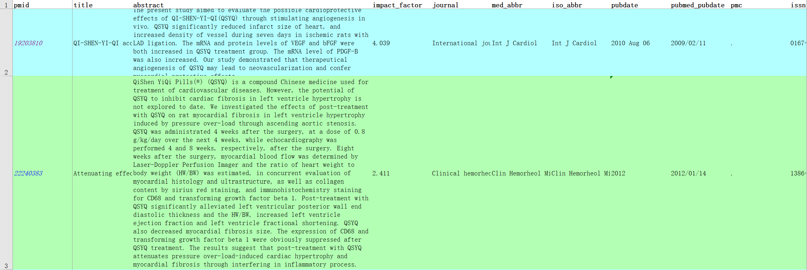
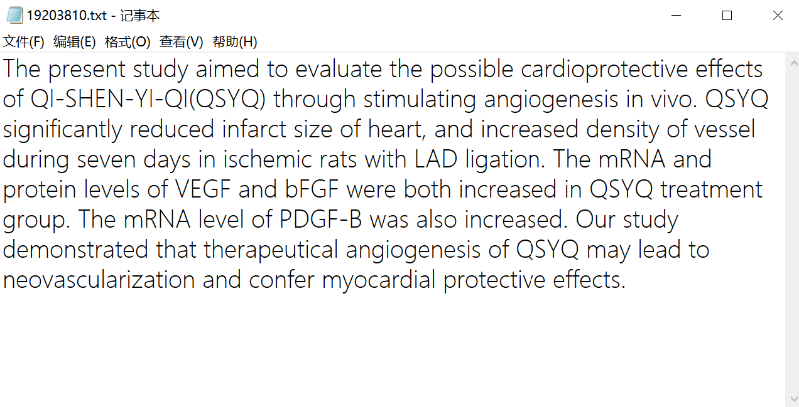
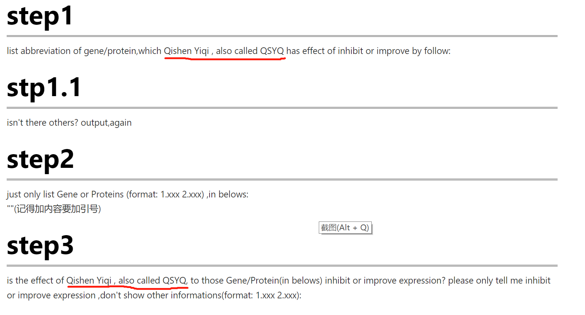

# 开发版中药关系抽取

## 功能

✅ 自动将PubMed上爬取的包含摘要的XLSX文件转换为以PMID命名的TXT文件。

✅ 自动调用OpenAI提供的模型进行关系抽取，支持整个文件夹批量处理。

✅ 自动将抽取出的关系保存到XLSX文档或MYSQL数据库中。

📓 [Colab 在线部署脚本](https://colab.research.google.com/drive/1PROgOBsghCpUGi30rwQXGC_rQo_gUxGY?usp=share_link) 【推荐】需科学上网，有效解决各种依赖及网络连接问题。



## 开发部署

### 1. 安装环境

```shell
# 克隆开发版项目
$ git clone -b dev_extract https://github.com/Ivan-YinTY/langchain-ChatGLM.git
# 安装依赖
$ pip install -r requirements.txt
```

### 2. 设置模型默认参数

在开始执行程序前，请先检查 [configs/extract_model_config.py](configs/extract_model_config.py) 中的各项模型参数设计是否符合需求。需要提供有效的OpenAI Key来调用LLMs。

### 3. 执行数据处理脚本

> 注：默认PubMed文件夹中提供了一个仅包含两条记录的测试数据集，实际使用过程中可以用真实数据集替换。

执行 [dataprocess.py](PubMed/dataprocess.py) 脚本对数据集进行拆分：
```shell
$ cd /content/langchain-ChatGLM/PubMed
$ python dataprocess.py
```

处理后的TXT结果文件保存在PubMed/Output目录下

执行后效果如下图所示：


### 4. 执行关系抽取脚本

> 注：OpenAI的API调用过程中尽可能使用原生住宅IP，否则会经常拒绝访问。

执行 [extract_demo.py](extract_demo.py) 脚本示例：
```shell
$ cd /content/langchain-ChatGLM
$ python extract_demo.py
```
该例程将自动将从PubMed/Output目录下所有TXT文件中抽取信息，并能够将结果保存到XLSX文件或MYSQL数据库中。

输出结果如下图所示：


## 替换提取主体

### 1. 修改提示语

多轮对话需要修改clitools目录下脚本所使用的提示语，替换位置如图

红色部分需要替换为新的实体名及其同义名称。

单轮对话可在configs/extract_model_config.py中直接进行修改。

### 2. 文献准备

请将文献表格文件放置在PubMed目录下，命名为pubmed.xlsx。

> 注：pubmed.xlsx中至少要包含abstract与pmid列。


### 致谢

🎉 [原始项目说明文档](README_cn.md)

💡 基于 [imClumsyPanda /langchain-ChatGLM](https://github.com/imClumsyPanda/langchain-ChatGLM) 项目开发，分支master。
